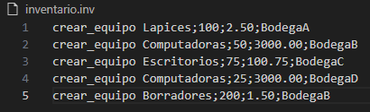
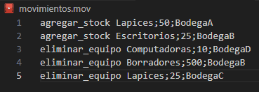
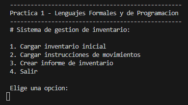
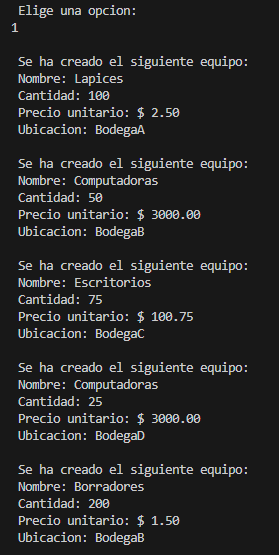
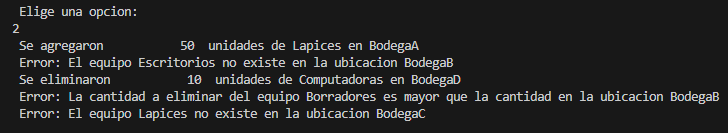
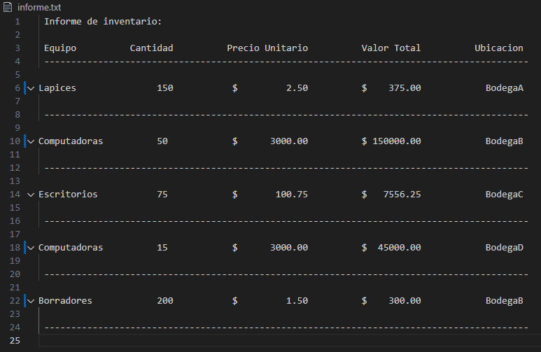
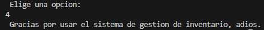

# Manual de Usuario
Bienvenido al sistema de gestión de inventarios, a continuación tienes un manual de instrucciones de como utilizarlo.

## Archivos necesarios

### Archivo de inventario inicial (.inv)

Primero que nada, necesitas un archivo con el nombre "inventario.inv", el cual servirá para cargar un inventario inicial, este archivo debe contener lineas de comandos de la siguiente forma:

```
crear_equipo nombre;cantidad;precio_unitario;ubicacion
```
En estas lineas de comando tendrás la instrucción "crear_equipo" que indicará que se tiene que crear un equipo nuevo y seguido de el tendrás los datos del equipo. Los datos serán los siguientes:

+ **Nombre:** es el nombre que tendrá el equipo.

+ **Cantidad:** es la cantidad inicial que tendrá el equipo.

+ **Precio unitario:** es el precio que tendrá ese equipo por cada unidad.

+ **Ubicación:** es la ubicación en la que se encontrará el equipo.

Cabe aclarar que se puede tener un mismo equipo en diferentes ubicaciones, con diferentes cantidades y diferentes precios unitarios.

Ejemplo:




### Archivo de movimientos (.mov)

También es necesario un archivo con el nombre "movimientos.mov", este archivo servirá para indicar los movimientos que tendrán los equipos, estos pueden tener las siguientes dos formas:

```
agregar_stock nombre;cantidad;ubicacion

eliminar_equipo nombre;cantidad;ubicacion
```
En estas lineas de comando estan las instrucciones "agregar_stock", que permite sumar la cantidad de un equipo; y "eliminar_equipo" que permite restar la cantidad de un equipo.

Ambas instrucciones validan que un equipo se encuentre en una misma ubicación, si este equipo no se encuentra en una ubicación, se mostrará un mensaje de error al intentar realizarse el movimiento.

De igual forma, si al eliminar un equipo se excede la cantidad que hay en los inventarios, se mostrará un mensaje de error, y se obviara esa instrucción.

Ejemplo:



## Iniciando el programa

### Menú principal


Al iniciar el programa, lo primero que podrás observar, es el menú principal.



En este menú, tendrás diferentes opciones:


### 1. Cargar inventario inicial

Al cargar inventario inicial, el programa leerá el archivo "inventario.inv" y agregará a una lista todos los datos que contengan las lineas de comando del archivo.

Ejemplo:



### 2. Cargar instrucciones de movimientos

Al cargar instrucciones de movimientos, el programa leerá el archivo "movimientos.mov" y dependiendo de la instrucción que lea se agregará o se eliminará a la lista cierta cantidad de un equipo, que se encuentré en una ubicación específica. 

Si en alguno de estos movimientos, no coincide la ubicación del equipo, se mostrará un mensaje de error. De igual forma si al eliminar un equipo se excede la cantidad en la lista de inventarios, se mostrará un mensaje de error.

Ejemplo:



### 3. Crear informe de inventario

Al crear un informe de inventario, se creará un archivo con el nombre "informe.txt" que mostrará detalladamente los equipos disponibles con su nombre, cantidad, precio unitario, valor total del equipo y su ubicación

Ejemplo:



### 4. Salir

Al presionar esta opción, el programa, finalizará su ejecución y terminarás de usar el sistema de gestión de inventarios.

